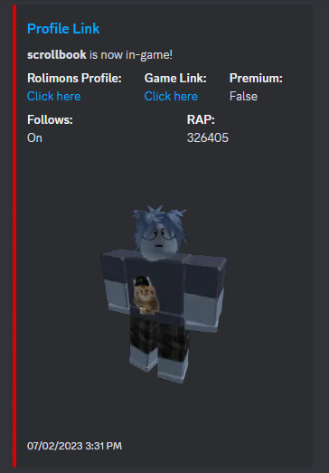

# RoChecker
* A python script used for a discord webhook that triggers a embedded message when a user with a limited item of choice comes online. It uses different parts of the Roblox API
to retrieve JSON data, and Discord API to send a POST request sending the embedded message.

> Used for finding user's with certain limited items for roblox trading purposes

> Hosted on Discloud

APIs used
-------------
* https://presence.roblox.com/docs/index.html
* https://thumbnails.roblox.com/docs/index.html
* https://users.roblox.com/docs/index.html
* https://github.com/discord/discord-api-docs

> Example Embedded Message with User Data

